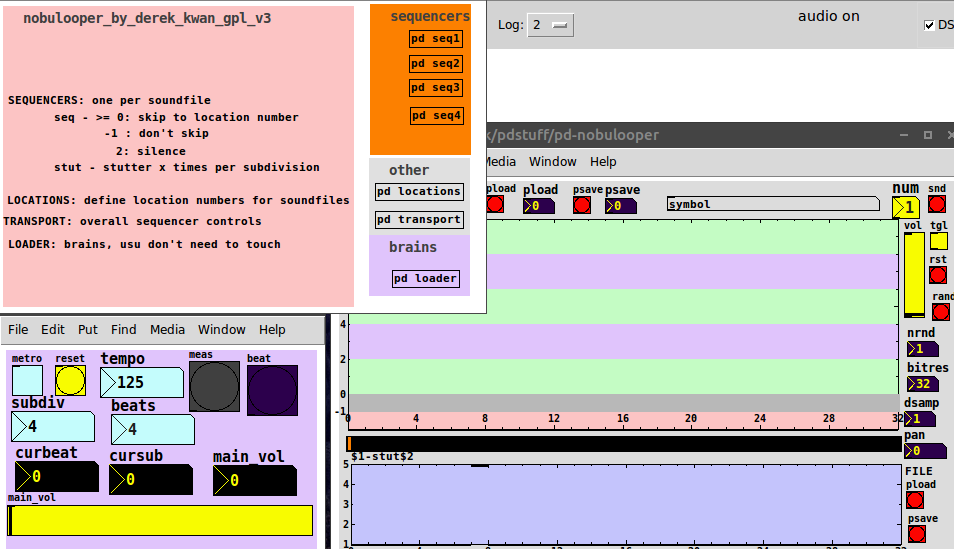

# pd-nobulooper
sample chopper environment released under gpl v3

nobulooper-MAIN.pd is the main patch that needs open.

requires dkwesley~, dknobu~, dkcospan~, dkvanctr from my pdkm library.

The transport/counter value is sent out on the variable pdkcnt and can be used by other patches.
